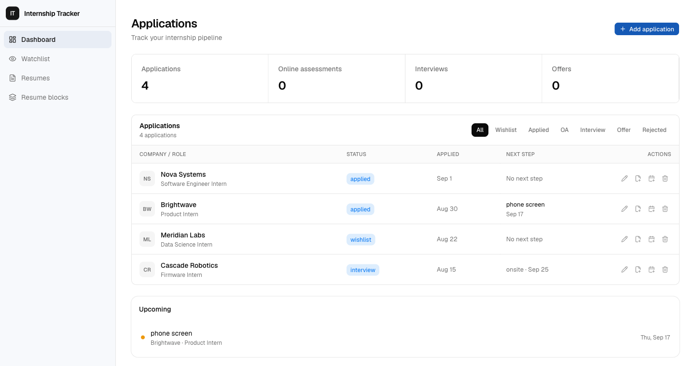

# Internship Tracker

A full-stack workspace for running an internship search: track every application, keep upcoming interviews and deadlines visible, tailor resumes for individual roles, and monitor career pages for changes.



## Features

- **Application pipeline** — track roles from wishlist through offer or rejection, with notes, links, dates, and stage filters.
- **Upcoming events** — attach interviews, assessments, follow-ups, and other dated events to an application.
- **Resume builder** — assemble tailored resumes from reusable entries and bullets, reorder content, tune layout settings, and preview the result live.
- **Versioned exports** — run preflight checks, save snapshots, compare or restore versions, attach the submitted version to an application, and export to PDF.
- **Career-page watchlist** — monitor job pages and surface content changes through a protected scheduled job.
- **Private user data** — Supabase Auth and PostgreSQL row-level security isolate each user's records.

## Stack

- Next.js 16 App Router and React 19
- TypeScript
- Supabase Auth and PostgreSQL
- Tailwind CSS 4 and shadcn/ui
- Playwright and the Node test runner
- Vercel Cron

## Local development

### Prerequisites

- Node.js 20.9 or newer
- npm
- A Supabase project, or Docker for the local Supabase stack

Install dependencies and create the local environment file:

```bash
npm install
cp .env.example .env.local
```

Set the following values in `.env.local`:

```dotenv
NEXT_PUBLIC_SUPABASE_URL=
NEXT_PUBLIC_SUPABASE_ANON_KEY=
SUPABASE_SERVICE_ROLE_KEY=
CRON_SECRET=
```

`NEXT_PUBLIC_SUPABASE_URL` and `NEXT_PUBLIC_SUPABASE_ANON_KEY` are required by the app. The service-role key is server-only and is required by the watchlist checker; never expose it to client code. `CRON_SECRET` protects the scheduled endpoint.

Apply the SQL files in `supabase/migrations/` to the Supabase project, then start the app:

```bash
npm run dev
```

Open [http://localhost:3000](http://localhost:3000). New users can create an account at `/signup`.

### Local Supabase

Start the local stack and inspect its generated URL and keys:

```bash
npx supabase start
npx supabase status
```

Copy the local API URL, anon key, and service-role key into `.env.local`. The local services use these default addresses:

- API: `http://127.0.0.1:54321`
- Studio: `http://127.0.0.1:54323`
- Mail viewer: `http://127.0.0.1:54324`

For an existing project whose legacy application tables are already present, reset and apply the timestamped migrations with:

```bash
npx supabase db reset
```

> **Legacy schema note:** `supabase/migrations/_create_applications.sql` predates the timestamped migration convention, so the Supabase CLI does not apply it automatically. When bootstrapping a completely new database, apply that file after `20250716233000_enable_moddatetime.sql` and before the remaining timestamped migrations. This ensures the `applications` and `events` tables—and the submitted-resume association—are created completely. Existing hosted projects that already contain those tables do not need this bootstrap step.

## Commands

| Command | Purpose |
| --- | --- |
| `npm run dev` | Start the development server |
| `npm run build` | Create a production build |
| `npm start` | Serve the production build |
| `npm run lint` | Run ESLint |
| `npm test` | Run the unit and integration-style TypeScript tests |
| `npm run test:e2e` | Run the Chromium end-to-end suite |

The Playwright suite requires a running local Supabase stack and deliberately refuses to run against a hosted Supabase URL. It provisions a temporary user and removes it during teardown when the local service-role key is available.

Database-level RLS and RPC checks live in `supabase/tests/`. Each test file documents its required environment variables and invocation at the top of the file.

## Routes

| Route | Description |
| --- | --- |
| `/` | Product landing page |
| `/login`, `/signup` | Email/password authentication |
| `/forgot-password`, `/reset-password` | Password recovery |
| `/dashboard` | Application pipeline, statistics, and upcoming events |
| `/watchlist` | Career-page change monitor |
| `/resumes` | Resume list |
| `/resumes/[resumeId]` | Resume editor, checks, versions, and export |
| `/resume-blocks` | Reusable resume-entry and bullet library |

## Project structure

```text
src/
  app/                 App Router pages, layouts, and the cron route
  components/features/ Product components and resume editor
  components/ui/       Shared UI primitives
  lib/resume/          Resume domain logic and tests
  lib/supabase/        Browser, server, and service-role clients
  types/               Supabase database types
supabase/
  migrations/          PostgreSQL schema and RPC migrations
  tests/               Database-level security and behavior tests
e2e/                   Playwright browser tests
```

## Watchlist cron

Vercel is configured in `vercel.json` to call `GET /api/cron/check-jobs` daily at `09:00 UTC`. The route expects:

```http
Authorization: Bearer <CRON_SECRET>
```

Set `NEXT_PUBLIC_SUPABASE_URL`, `NEXT_PUBLIC_SUPABASE_ANON_KEY`, `SUPABASE_SERVICE_ROLE_KEY`, and `CRON_SECRET` in the Vercel project environment before deploying. The service-role credential is used only on the server to read shared URL snapshots and update change flags.

## Security notes

- User-owned tables use row-level security keyed by `auth.uid()`.
- Resume mutations that need ordering or revision guarantees are performed through PostgreSQL RPCs.
- The service-role client is isolated in server-only code.
- Secrets belong in `.env.local` and deployment environment settings; only the two `NEXT_PUBLIC_` values may be sent to the browser.
